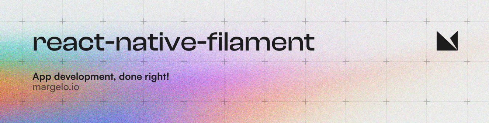

<a href="https://margelo.com">
  <picture>
    <source media="(prefers-color-scheme: dark)" srcset="./img/banner-dark.png" />
    <source media="(prefers-color-scheme: light)" srcset="./img/banner-light.png" />
    
  </picture>
</a>

<br />

### Features

react-native-filament is a powerful 3D rendering engine for React Native. It features:

* 🧊 Native C++ physically based rendering using [filament](https://github.com/google/filament)
* 🏀 Native C++ physics using [bullet3](https://github.com/bulletphysics/bullet3)
* 🏎️ GPU-accelerated by Metal and OpenGL/Vulkan
* 📹 Renders on separate Threads
* 📦 Easy to use reactive declarative API
* 📚 Well documented
* ✅ Supports old and new arch

### Installation

See the [installation guide in the docs.](https://margelo.github.io/react-native-filament/docs/guides)

### Example

```tsx
import { FilamentScene, FilamentView, Model, Camera, DefaultLight } from 'react-native-filament'

function App() {
  return (
    <FilamentScene>
      <FilamentView
        style={{ width: 100, height: 100 }}
        model={model}
      >

        {/* Render with the default camera and light: */}
        <Camera />
        <DefaultLight >

        {/* Add a model to the scene (only glb supported yet): */}
        <Model source={require('./duck.glb')}>

      </FilamentView>
    </FilamentScene>
  )
}
```

> See the [example](./package/example/Shared) app


### Comparison with other libraries

One library to render 3D content is [expo-gl](https://docs.expo.dev/versions/latest/sdk/gl-view) usually used together with [expo-three](https://www.npmjs.com/package/expo-three). react-native-filament has a few advantages over expo-gl:

- Supports using `glb` files out of the box
- On iOS react-native-filament uses Metal, where expo-gl is using the [deprecated OpenGL ES](https://developer.apple.com/documentation/opengles) apple framework
- The rendering happens on the JS thread for `expo-three`, where react-native-filament uses a separate thread (and filament processes the rendering commands in a pool of different threads)
- filament is battle tested and react-native-filament is used in production apps with millions of users already, proven to be highly stable


### Contributing

We welcome contributions to react-native-filament! 🎉

After cloning the repo make sure you have the submodules clones as well:

```sh
git submodule update --init --recursive --depth 1
```

Install all node modules (including the examples)

```sh
cd package
bun i
```

And finally build filament and bullet3:

```sh
# Inside ./package
bun build-bullet3
bun build-filament:release # or yarn build-filament:debug
```

You can then build one of the example apps in `package/example/AppExamplePaper` or `package/example/AppExampleFabric`.

Note: If building filament fails for you, you can download the pre-built binaries from the npm package.
Simply run `bun setup-filament-quick`. The binaries will be in release build and any edits in /filament will be ignored (as you're not building from source in this case).

### Adopting at scale

react-native-filament is provided _as is_.

If you need help with integrating react-native-filament in your app or have additional bugfixing or feature requests, reach out to us at [margelo.com](https://margelo.com).

### Socials

* 🐦 [**Follow us on Twitter**](https://twitter.com/margelo_com) for updates
* 💬 [**Join the Margelo Community Discord**](https://discord.gg/6CSHz2qAvA) for chatting about react-native-filament

### Attributions & thanks

#### Slay

react-native-filament was built for- and mostly funded by [Slay](https://www.slay.cool) - the creators of [Pengu](https://www.slay.cool/pengu)! 🐧 Without them, react-native-filament wouldn't exist, so thanks Slay! ❤️

#### Filament and Bullet3

react-native-filament uses [filament](https://github.com/google/filament) (an amazing library by Google), and [bullet3](https://github.com/bulletphysics/bullet3) (an amazing physics library by Bullet Physics). Without those core libraries and the geniuses behind them, react-native-filament wouldn't exist - so thanks Google & Bullet! ❤️

#### Copyrights

The example app in this project uses several free assets:
- Image by <a href="https://www.freepik.com/free-ai-image/space-travel-collage-design_94964745.htm#fromView=search&page=1&position=1&uuid=cf66f9c3-2d56-4228-a3cf-de7c07d418fb">freepik</a>
- Image by <a href="https://www.freepik.com/free-psd/3d-icon-product-management_44990845.htm#fromView=search&page=2&position=0&uuid=691aae54-efdf-451c-9112-0ff373e761e7">Freepik</a>
- Image by <a href="https://www.freepik.com/free-psd/3d-collection-with-hands-holding-smartphone_13678985.htm#fromView=search&page=1&position=3&uuid=7761a685-d1b6-4202-8505-9a872775cbbb">Freepik</a>
- Michelle by [mixamo](https://www.mixamo.com/#/?page=2&type=Character)
- "Buster Drone" (https://skfb.ly/TBnX) by LaVADraGoN is licensed under Creative Commons Attribution-NonCommercial (http://creativecommons.org/licenses/by-nc/4.0/).
